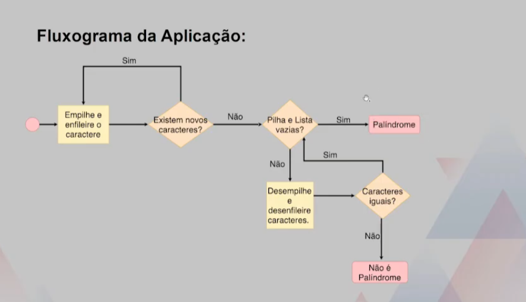

Nessa aula 8 implementaremos uma fila como **lista encadeada**.

Link para o vídeo da aula -> https://www.youtube.com/watch?v=1YxttUx-x7A

### O que faremos?
- Estrutura do Nó
- Tipo Abstrato de Dados
- Detalhes de Implementação
- Aplicações da Estrutura

Dois ponteiros *front* e *rear* apontarão para o início e final da fila, respctivamente.

Queremos que inserções e remoções ocorram em tempo constante. Em outras palavras, independem do número de elementos na estrutura.

Utilizaremos essa estrutura para verificar se uma determinada string é um palíndrome. Segue fluxograma da aplicação: 
___
