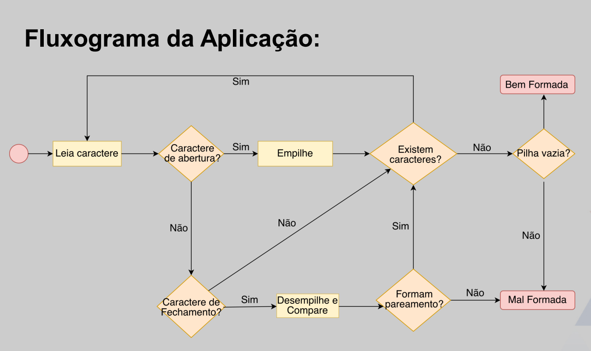

Nessa aula 8 implementaremos uma pilha como **lista encadeada**.

Link para o vídeo da aula -> https://www.youtube.com/watch?v=Xlkh6-10ILw

### O que está sendo feito?
- Estrutura do Nó
- Tipo Abstrato de Dados
- Detalhes de Implementação
- Aplicações da Estrutura

O ponteiro structure sempre apontará para o *elemento que está no topo da pilha*.

Queremos que inserções e remoções ocorram em tempo constante. Em outras palavras, independem do número de elementos na estrutura.

Utilizaremos essa estrutura para verificar o alinhamento de strings. Segue o fluxograma da aplicação: 
___
